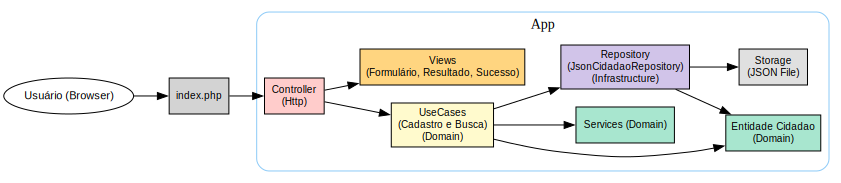

# Desafio Jungle

Sistema simples para cadastro e consulta de cidadãos utilizando o NIS (Número de Identificação Social), desenvolvido em PHP puro com Programação Orientada a Objetos.

---

## 📋 Funcionalidades

-   Cadastro de cidadão com nome (gera NIS automaticamente);
-   Consulta de cidadão por NIS;
-   Persistência local via arquivo JSON;
-   Interface simples via navegador;
-   Arquitetura desacoplada com separação de responsabilidades.

---

## 🧰 Tecnologias utilizadas

-   PHP 8.2+
-   Composer (autoload)
-   Docker & Docker Compose
-   Padrões: OOP, separação em camadas, SRP

---

## 🏛️ Arquitetura



---

## 🖼️ Protótipo (Figma)

[🔗 Clique para ir a demonstração do Protótipo](https://www.figma.com/design/bjLB87csStazCGEeZRRdts/Sistema-de-Cadastro-NIS?node-id=2016-542&t=GR49yf3G49OclF4S-1)

E execute o protótipo visual, clicando no canto superior direito, no icone de execução


---

## 🚀 Como executar o projeto

### 1. Pré-requisitos

-   Docker
-   Docker Compose

### 2. Clone o repositório

```bash
git clone https://github.com/andrewwmax/desafio-jungle.git
cd desafio-jungle
```

### 3. Suba os containers

#### 3.1 Rode os testes

```bash
docker-compose run --rm test
```

OU

```bash
make test
```

#### 3.2 Rode a aplicação

```bash
docker-compose up --build
```

### 4. Acesse no navegador

```bash
http://localhost:8080
```

Você verá a tela com:

-   Um formulário de cadastro de cidadão

-   Um formulário de busca por NIS

---

## 🗂️ Estrutura do projeto

```
.
├── app
│   ├── Application         # Contratos
│   │   └── Contracts
│   ├── Domain              # Entidades e serviços
│   │   ├── Services
│   │   └── UseCases
│   ├── Http                # Controller
│   │   └── Controller
│   ├── Infrastructure      # Repositórios
│   │   └── Repository
│   ├── Storage             # Persistência dos cidadãos em JSON
├── docker                  # Configuração do Docker
│   ├── nginx
│   └── php
├── docs                    # Documents
│   └── arquitetura
├── views                   # Views da aplicação (front)
|   ├── layouts
│   └── cidadao
├── tests                   # Testes
├── nginx
├── public                  # Entrada da aplicação (index.php)
├── vendor                  # Dependências gerenciadas pelo Composer
├── composer.json           # Autoload PSR-4
├── docker-compose.yml
└── README.md

```

---

## ✨ Melhorias futuras (bonus)

-   [x] ✅ Camada de apresentação mais rica com HTML/CSS/JS separados;
-   [x] 🟢 Testes automatizados (PHPUnit);
-   [ ] 🟠 Validações mais robustas;
-   [ ] 🔜 Integração com banco de dados relacional (Postgres).

---

## 👤 Autor

Feito com 💻 por André Couto.

---
